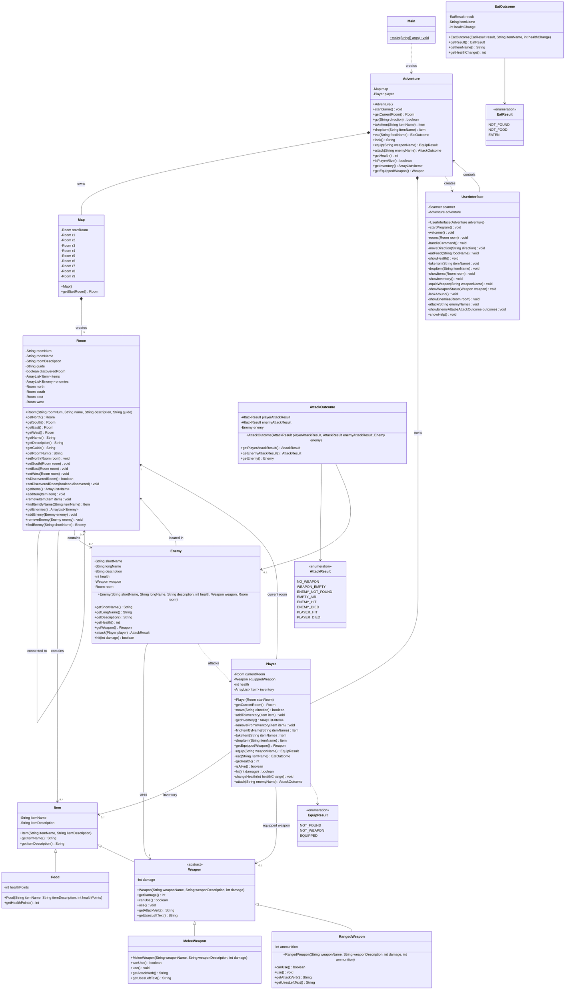

```mermaid
classDiagram
    class Main {
        +main(String[] args)$ void
    }

    class Adventure {
        -Map map
        -Player player
        +Adventure()
        +startGame() void
        +getCurrentRoom() Room
        +go(String direction) boolean
        +takeItem(String itemName) Item
        +dropItem(String itemName) Item
        +eat(String foodName) EatOutcome
        +look() String
        +equip(String weaponName) EquipResult
        +attack(String enemyName) AttackOutcome
        +getHealth() int
        +isPlayerAlive() boolean
        +getInventory() ArrayList~Item~
        +getEquippedWeapon() Weapon 
        }

    class UserInterface {
        -Scanner scanner
        -Adventure adventure
        +UserInterface(Adventure adventure)
        +startProgram() void
        -welcome() void
        -rooms(Room room) void
        -handleCommand() void
        -moveDirection(String direction) void
        -eatFood(String foodName) void
        -showHealth() void
        -takeItem(String itemName) void
        -dropItem(String itemName) void
        -showItems(Room room) void
        -showInventory() void
        -equipWeapon(String weaponName) void
        -showWeaponStatus(Weapon weapon) void
        -lookAround() void
        -showEnemies(Room room) void
        -attack(String enemyName) void
        -showEnemyAttack(AttackOutcome outcome) void
        +showHelp() void
    }

    class Map {
        -Room startRoom
        -Room r1
        -Room r2
        -Room r3
        -Room r4
        -Room r5
        -Room r6
        -Room r7
        -Room r8
        -Room r9
        +Map()
        +getStartRoom() Room
    }

    class Room {
        -String roomNum
        -String roomName
        -String roomDescription
        -String guide
        -boolean discoveredRoom
        -ArrayList~Item~ items
        -ArrayList~Enemy~ enemies
        -Room north
        -Room south
        -Room east
        -Room west
        +Room(String roomNum, String name, String description, String guide)
        +getNorth() Room
        +getSouth() Room
        +getEast() Room
        +getWest() Room
        +getName() String
        +getDescription() String
        +getGuide() String
        +getRoomNum() String
        +setNorth(Room room) void
        +setSouth(Room room) void
        +setEast(Room room) void
        +setWest(Room room) void
        +isDiscoveredRoom() boolean
        +setDiscoveredRoom(boolean discovered) void
        +getItems() ArrayList~Item~
        +addItem(Item item) void
        +removeItem(Item item) void
        +findItemByName(String itemName) Item
        +getEnemies() ArrayList~Enemy~
        +addEnemy(Enemy enemy) void
        +removeEnemy(Enemy enemy) void
        +findEnemy(String shortName) Enemy
    }

    class Player {
        -Room currentRoom
        -Weapon equippedWeapon
        -int health
        -ArrayList~Item~ inventory
        +Player(Room startRoom)
        +getCurrentRoom() Room
        +move(String direction) boolean
        +addToInventory(Item item) void
        +getInventory() ArrayList~Item~
        +removeFromInventory(Item item) void
        +findItemByName(String itemName) Item
        +takeItem(String itemName) Item
        +dropItem(String itemName) Item
        +getEquippedWeapon() Weapon
        +equip(String weaponName) EquipResult
        +eat(String itemName) EatOutcome
        +getHealth() int
        +isAlive() boolean
        +hit(int damage) boolean
        -changeHealth(int healthChange) void
        +attack(String enemyName) AttackOutcome
    }

    class Enemy {
        -String shortName
        -String longName
        -String description
        -int health
        -Weapon weapon
        -Room room
        +Enemy(String shortName, String longName, String description, int health, Weapon weapon, Room room)
        +getShortName() String
        +getLongName() String
        +getDescription() String
        +getHealth() int
        +getWeapon() Weapon
        +attack(Player player) AttackResult
        +hit(int damage) boolean
    }

    class Item {
        -String itemName
        -String itemDescription
        +Item(String itemName, String itemDescription)
        +getItemName() String
        +getItemDescription() String
    }

    class Food {
        -int healthPoints
        +Food(String itemName, String itemDescription, int healthPoints)
        +getHealthPoints() int
    }

    class Weapon {
        <<abstract>>
        -int damage
        +Weapon(String weaponName, String weaponDescription, int damage)
        +getDamage() int
        +canUse() boolean
        +use() void
        +getAttackVerb() String
        +getUsesLeftText() String
    }

    class MeleeWeapon {
        +MeleeWeapon(String weaponName, String weaponDescription, int damage)
        +canUse() boolean
        +use() void
        +getAttackVerb() String
        +getUsesLeftText() String
    }

    class RangedWeapon {
        -int ammunition
        +RangedWeapon(String weaponName, String weaponDescription, int damage, int ammunition)
        +canUse() boolean
        +use() void
        +getAttackVerb() String
        +getUsesLeftText() String
    }

    class AttackOutcome {
        -AttackResult playerAttackResult
        -AttackResult enemyAttackResult
        -Enemy enemy
        +AttackOutcome(AttackResult playerAttackResult, AttackResult enemyAttackResult, Enemy enemy)
        +getPlayerAttackResult() AttackResult
        +getEnemyAttackResult() AttackResult
        +getEnemy() Enemy
    }

    class EatOutcome {
        -EatResult result
        -String itemName
        -int healthChange
        +EatOutcome(EatResult result, String itemName, int healthChange)
        +getResult() EatResult
        +getItemName() String
        +getHealthChange() int
    }

    class AttackResult {
        <<enumeration>>
        NO_WEAPON
        WEAPON_EMPTY
        ENEMY_NOT_FOUND
        EMPTY_AIR
        ENEMY_HIT
        ENEMY_DIED
        PLAYER_HIT
        PLAYER_DIED
    }

    class EatResult {
        <<enumeration>>
        NOT_FOUND
        NOT_FOOD
        EATEN
    }

    class EquipResult {
        <<enumeration>>
        NOT_FOUND
        NOT_WEAPON
        EQUIPPED
    }

    Item <|-- Food
    Item <|-- Weapon
    Weapon <|-- MeleeWeapon
    Weapon <|-- RangedWeapon

    Main ..> Adventure : creates
    Adventure *-- Map : owns
    Adventure *-- Player : owns
    Adventure ..> UserInterface : creates
    UserInterface --> Adventure : controls

    Map *-- "9" Room : creates
    Room --> "0..4" Room : connected to
    Room --> "0..*" Item : contains
    Room --> "0..*" Enemy : contains

    Player --> "1" Room : current room
    Player --> "0..*" Item : inventory
    Player --> "0..1" Weapon : equipped weapon

    Enemy --> "1" Weapon : uses
    Enemy --> "1" Room : located in
    Enemy ..> Player : attacks

    AttackOutcome --> AttackResult
    AttackOutcome --> "0..1" Enemy
    EatOutcome --> EatResult
    Player ..> EquipResult
```
